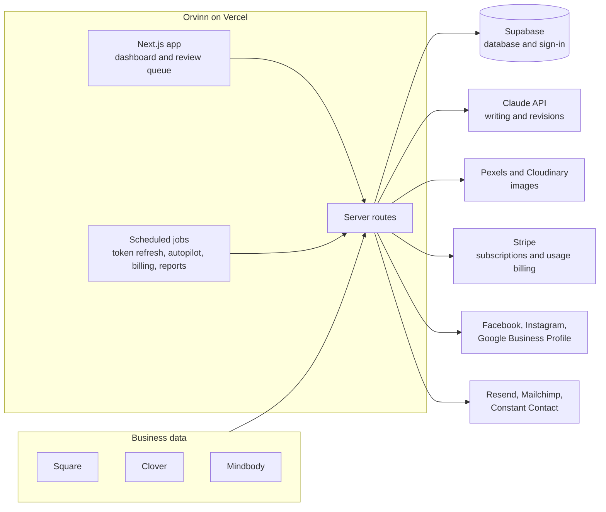

# Orvinn — Case Study

**AI marketing automation for small businesses, real estate professionals, and agencies.**
Built and run by a solo founder, using AI coding agents from the first commit to live billing.

[orvinn.app](https://orvinn.app) · [Portfolio](https://fgarzon78.github.io/felipe-garzon-portfolio/) · Felipe Garzon

> This repository is a write-up, not the product's source code. It explains what Orvinn does, how it's built, and the decisions behind it.

---

## The problem

Small businesses know they should post on social media, send emails, and follow up with customers. Most don't have the time or a marketing team. Meanwhile, they already sit on useful information: what's selling, what isn't, which classes have open spots, which listings just hit the market.

Orvinn turns that information into marketing. It connects to the tools a business already uses, writes posts and emails in the business's voice, and publishes them on a schedule, with a person approving along the way when they want to.

## What it does

- **Creates content from real business data.** Sales from Square and Clover, class schedules from Mindbody, and real estate listings become social posts, email campaigns, and promotions.
- **Publishes everywhere from one place.** Facebook, Instagram, and Google Business Profile, with previews that match how each platform will actually show the post.
- **Runs on autopilot or with review.** Businesses can let Orvinn post on a schedule, or send everything through an approval queue first.
- **Handles email marketing.** A built-in email composer with templates, plus one-click export of finished campaigns to Mailchimp or Constant Contact.
- **Brings customer conversations together.** One inbox for reviews and comments across platforms, with AI-drafted replies that match the customer's language.
- **Reports on what's working.** Weekly reports and an AI "posting playbook" based on the business's own engagement data.
- **Supports agencies.** One agency account can manage many client workspaces, with team members, roles, and a shared review flow.

## How it's built

| Part | Tool |
|---|---|
| App framework | Next.js 14 (App Router) |
| Hosting and deploys | Vercel, deploying automatically from GitHub |
| Database and sign-in | Supabase, with Google sign-in on a branded domain |
| AI | Anthropic Claude API |
| Billing | Stripe subscriptions, per-seat billing, and Stripe Meters for usage |
| Email | Resend, plus Mailchimp and Constant Contact export |
| Images | Pexels for stock photos, Cloudinary for hosting |
| Monitoring | UptimeRobot and a public status page |

## Decisions and tradeoffs

These are the calls I'd talk through with any founder building something similar.

### 1. Charge for what customers value, protect costs separately

The first version limited usage by counting how many times the AI generated content. But customers don't think in generations; they think in posts that actually go out. The model I settled on: each plan includes a set number of **published** posts per month (30 / 90 / 90), no matter how many social accounts are connected, and one approval that publishes to several platforms counts once. A separate, much higher and mostly invisible limit on AI generations protects against runaway API costs.

**Lesson:** the number a customer sees should match how they think about value. Cost protection can live behind the scenes.

### 2. Build one connection pattern, then reuse it

Square and Clover both provide sales data, but their sign-in flows, token lifetimes, and webhook styles differ. Instead of building each one separately, both plug into a shared structure for connections and orders. Clover's access tokens expire every 30 minutes, so a scheduled job refreshes them every 5 minutes; Square's refresh daily. The rest of the app doesn't need to know which provider a business uses.

**Lesson:** the second integration is where you decide whether the third one takes a week or a day.

### 3. Design for agencies early

Agencies manage many businesses at once, so the data model has agencies, workspaces, and workspace members, and every relevant table is tied to a workspace. One shared helper applies that filter, so data from one client can't leak into another's view. Adding this early was more work up front, but retrofitting it later would have touched almost every page.

### 4. Keep a human in the loop on AI changes

When a reviewer asks for changes, Orvinn revises the post automatically on the server. It doesn't send the result straight out. The reviewer sees the AI's fix, compares it with earlier versions, and confirms before anything is published.

**Lesson:** AI speed matters most when people still trust what goes out under their name.

### 5. Use a partner where building it yourself adds no value

Publishing directly to every social network means separate app reviews, token handling, and API changes for each one. Orvinn uses Ayrshare with a separate profile per customer instead, which let me focus on the content and review experience that actually sets the product apart.

### 6. Small problems that taught big lessons

- **Stock photos failing in production.** The stock photo service blocked requests from the server, so scheduled posts went out without images. The fix was copying each chosen photo to Cloudinary first, which gives a stable link every platform can load.
- **Email names turning into italics.** Orvinn's personalization tags had to be converted into Mailchimp's format, which uses asterisks. Running that conversion before the text formatting step turned the asterisks into italics. Changing the order fixed it.
- **App store rules shape your billing.** Listing on the Shopify App Store requires using Shopify's own billing instead of Stripe. That's a business decision, not just a technical one, and worth knowing before you build.

## How I build

I'm a non-traditional builder. AI coding agents (mainly Claude) write the code; I own the product, the decisions, and what ships.

1. Describe the change and review the plan with the AI.
2. Apply the change as a precise, repeatable edit.
3. Run a full type check before anything leaves my machine.
4. Push to GitHub, and Vercel deploys automatically.

Working this way, a solo founder shipped a product with subscription billing, five business-software integrations, three publishing platforms, an agency model, and production monitoring.

## Where it's headed

- White-label option for agencies
- AI-generated images as an alternative to stock photos
- Fully automatic recurring email campaigns
- Light theme
- A permanent test environment alongside production

---

**Felipe Garzon** · Founder, Orvinn · Doral, Florida · English and Spanish
[felogarzon@gmail.com](mailto:felogarzon@gmail.com) · [orvinn.app](https://orvinn.app)
